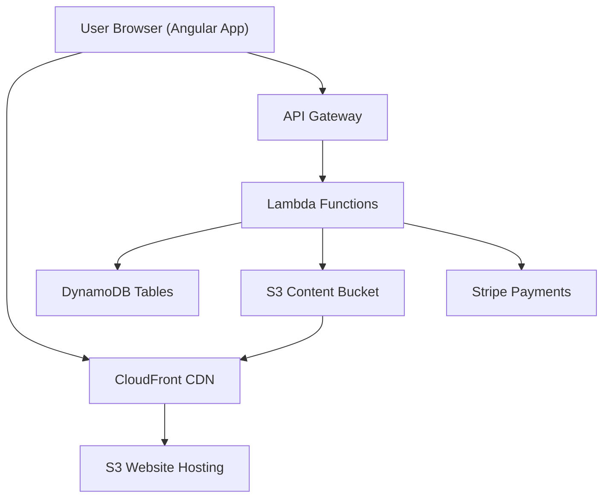

# Music Tutorial Web Application – Beginner-Friendly, End-to-End Guide (Standalone Angular + AWS)

Welcome! This guide helps you build a **music tutorial web app** with a **standalone Angular frontend** and an **AWS serverless backend**.  
You’ll start locally with a **mock backend** so you can run the app immediately, then swap in AWS later.

---

## 🔭 Architecture Overview (Mermaid Diagram)



---

## Phase 1: AWS Infrastructure Setup

### 1.1 Create AWS Account and Configure CLI
```bash
# Install AWS CLI
curl "https://awscli.amazonaws.com/awscli-exe-linux-x86_64.zip" -o "awscliv2.zip"
unzip awscliv2.zip
sudo ./aws/install

# Configure credentials
aws configure
```

### 1.2 Set Up Core Services

#### DynamoDB Tables
```javascript
// infrastructure/tables.js
const tables = {
  Users: {
    TableName: 'music-tutorial-users',
    KeySchema: [
      { AttributeName: 'userId', KeyType: 'HASH' }
    ],
    AttributeDefinitions: [
      { AttributeName: 'userId', AttributeType: 'S' },
      { AttributeName: 'email', AttributeType: 'S' }
    ],
    GlobalSecondaryIndexes: [{
      IndexName: 'email-index',
      Keys: { email: 'HASH' }
    }]
  },
  Courses: {
    TableName: 'music-tutorial-courses',
    KeySchema: [
      { AttributeName: 'courseId', KeyType: 'HASH' }
    ]
  },
  Enrollments: {
    TableName: 'music-tutorial-enrollments',
    KeySchema: [
      { AttributeName: 'userId', KeyType: 'HASH' },
      { AttributeName: 'courseId', KeyType: 'RANGE' }
    ]
  }
};
```

#### S3 Buckets Configuration
```yaml
# infrastructure/s3-config.yaml
Buckets:
  ContentBucket:
    Name: music-tutorial-content
    Versioning: Enabled
    Cors:
      - AllowedOrigins: ['*']
        AllowedMethods: [GET, PUT, POST]
        AllowedHeaders: ['*']
  
  WebsiteBucket:
    Name: music-tutorial-website
    WebsiteConfiguration:
      IndexDocument: index.html
      ErrorDocument: error.html
```

### 1.3 Cognito User Pool Setup
```javascript
// infrastructure/cognito-config.js
const userPoolConfig = {
  PoolName: 'music-tutorial-users',
  Policies: {
    PasswordPolicy: {
      MinimumLength: 8,
      RequireUppercase: true,
      RequireLowercase: true,
      RequireNumbers: true,
      RequireSymbols: true
    }
  },
  Schema: [
    {
      Name: 'email',
      AttributeDataType: 'String',
      Required: true,
      Mutable: false
    },
    {
      Name: 'name',
      AttributeDataType: 'String',
      Required: true,
      Mutable: true
    },
    {
      Name: 'custom:role',
      AttributeDataType: 'String',
      Mutable: true
    }
  ],
  AutoVerifiedAttributes: ['email'],
  MfaConfiguration: 'OPTIONAL'
};
```

---

# Phase 2 — Backend (Lambda + API Gateway + Stripe)

### 2.1 Project Setup
```bash
# backend/setup.sh
npm init -y
npm install serverless -g
```

### 2.2 Shared Database Utility
```typescript
// backend/layers/shared/nodejs/utils/database.ts
// Example DynamoDB client wrapper
import { DynamoDB } from "aws-sdk";
const client = new DynamoDB.DocumentClient();
export default client;
```

### 2.3 Auth Lambdas
```typescript
// backend/functions/auth/handler.ts
export const signup = async (event) => {
  // signup logic here
};
```

### 2.4 Course Lambdas
```typescript
// backend/functions/courses/handler.ts
export const listCourses = async () => {
  // list courses
};
```

### 2.5 Payments (Stripe) Lambdas
```typescript
// backend/functions/payments/handler.ts
export const checkout = async () => {
  // stripe checkout
};
```

### 2.6 Serverless Config & Deploy
```yaml
# backend/serverless.yml
service: music-tutorial-backend
provider:
  name: aws
  runtime: nodejs18.x
functions:
  auth:
    handler: functions/auth/handler.signup
  courses:
    handler: functions/courses/handler.listCourses
  payments:
    handler: functions/payments/handler.checkout
```

Deploy:
```bash
cd backend
npx serverless deploy
```

---

# Phase 3 — Angular Frontend (Standalone, with Mock Mode)

### 3.1 Create Angular Project
```bash
# frontend/setup.sh
ng new music-tutorial-frontend --standalone
```

### 3.2 Project Structure
```text
# frontend/structure.txt
src/
  app/
    core/
      services/
      guards/
      interceptors/
    features/
      admin/
      courses/
```

---

### 3.3 Authentication Service (Mock first)
```typescript
// src/app/core/services/auth.service.ts
import { Injectable } from '@angular/core';
@Injectable({ providedIn: 'root' })
export class AuthService {
  loginMock() { return { user: 'test', token: '123' }; }
}
```

---

### 3.4 Course Service (Mock first)
```typescript
// src/app/core/services/course.service.ts
import { Injectable } from '@angular/core';
@Injectable({ providedIn: 'root' })
export class CourseService {
  getCourses() { return [{ id: 1, title: 'Guitar Basics' }]; }
}
```

---

### 3.5 Admin Dashboard Component
```typescript
// src/app/features/admin/admin-dashboard/admin-dashboard.component.ts
import { Component } from '@angular/core';
@Component({
  selector: 'app-admin-dashboard',
  standalone: true,
  template: `<h2>Admin Dashboard</h2>`
})
export class AdminDashboardComponent {}
```

---

### 3.6 Course List Component (Student View)
```typescript
// src/app/features/courses/course-list/course-list.component.ts
import { Component } from '@angular/core';
@Component({
  selector: 'app-course-list',
  standalone: true,
  template: `<h2>Course List</h2>`
})
export class CourseListComponent {}
```

---

### 3.7 Route Guards
```typescript
// src/app/core/guards/auth.guard.ts
import { inject } from '@angular/core';
import { CanActivateFn } from '@angular/router';
export const authGuard: CanActivateFn = () => {
  return true; // mock always true
};
```

---

### 3.8 HTTP Interceptor
```typescript
// src/app/core/interceptors/auth.interceptor.ts
import { HttpInterceptorFn } from '@angular/common/http';
export const authInterceptor: HttpInterceptorFn = (req, next) => {
  const cloned = req.clone({ setHeaders: { Authorization: 'Bearer mock' } });
  return next(cloned);
};
```

---

# Phase 4 — Build & Deploy

### 4.1 Deploy Backend
```bash
cd backend
npx serverless deploy
```

### 4.2 Frontend Build & Deploy to S3 + CloudFront
```bash
cd frontend/music-tutorial-frontend
ng build --configuration production

aws s3api create-bucket --bucket music-tutorial-website --region us-east-1
aws s3 website s3://music-tutorial-website/ --index-document index.html --error-document error.html

aws s3 sync dist/music-tutorial-frontend/ s3://music-tutorial-website/ --acl public-read

aws cloudfront create-distribution   --origin-domain-name music-tutorial-website.s3.amazonaws.com   --default-root-object index.html
```

### 4.3 Angular Environments
```typescript
// src/environments/environment.prod.ts
export const environment = {
  production: true,
  apiUrl: 'https://api.example.com',
  mock: false
};
```

---

# Phase 5 — Security & Optimization
```yaml
# security/best-practices.yaml
enableWAF: true
useSecretsManager: true
enableCloudTrail: true
```

# Phase 6 — Monitoring & Testing
```typescript
// src/app/core/services/course.service.spec.ts
import { TestBed } from '@angular/core/testing';
import { CourseService } from './course.service';

describe('CourseService', () => {
  let service: CourseService;
  beforeEach(() => {
    TestBed.configureTestingModule({});
    service = TestBed.inject(CourseService);
  });
  it('should return mock courses', () => {
    expect(service.getCourses().length).toBeGreaterThan(0);
  });
});
```

---

## 🔁 Switching from Mock to AWS
1. Open `src/environments/environment.ts` and set `mock: false`.  
2. Fill in your `apiUrl`, `cognitoUserPoolId`, `cognitoClientId`, and `stripePublicKey`.  
3. Ensure CORS is configured on API Gateway and S3 buckets.
